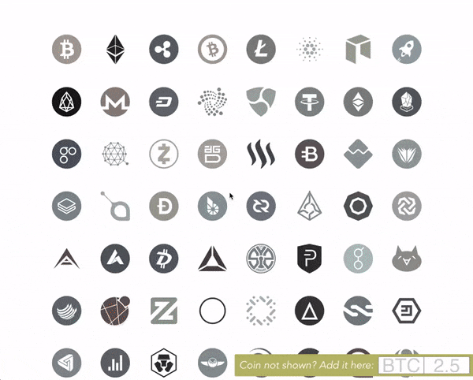
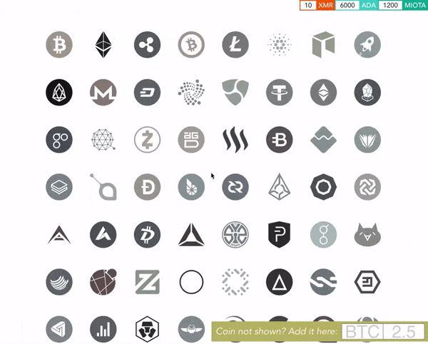

# Coinmarketcap Crypto Hodl Donut

A crypto donut that lets you view and keep track of a portfolio of coins/tokens based on data from [coinmarketcap.com](https://coinmarketcap.com).

## where to get it

Chrome Extension: [url]()

Otherwise just clone the repo, then `yarn install` and `yarn run dev` to run locally

## how to use it

Two simple steps:

1. create your portfolio by adding values per coin/token
2. switch to the donut (press `←`) to view the total value of the portfolio

There are a bunch of key bindings that aim to allow and/or enhance usability. For example, you can use `f` to filter coins/tokens. If the token you're searching for isn't displayed (but you know it is listed on coinmarketcap), you can add it using the input in the lower right corner:

Api queries are set to return 100 items by default. If coins in your portfolio are ranked beyond the top 100 list on coinmarketcap, you'll need to adjust the query. Bring up the api limit options by pressing `a` (shown above).

Finally, you can customize the donut with currency options (press `c`), and with display of percent change over the previous hour, day, or week (press `p`):

## key bindings

* `←` and `→` for **switching between coin/token view and donut view**. Press the left arrow (to view the donut), and right arrow (to view the coin/token list).

* `f` for **filtering**. If you don't immediately see the icon for the coin you're looking for, you can press `f` to filter the displayed list of icons. You can type in the name of the coin or the ticker value, e.g. entering "Cardano" or "ADA" will narrow the search down to that coin.

* `c` for **currency**. You can set the currency for values displayed in the donut. Press `c` to invoke the currency preferences (USD, EUR, and BTC are available).

* `p` for **percent change**. You can specify the duration for the percent change (this applies to individual coin/token as well as the aggregate value of the portfolio). Press `p` to bring up the available options (1 hour, 1 day, and 1 week).

* `a` for **api limit**. The good folks behind [coinmarketcap.com](https://coinmarketcap.com) are offering a free service, and this project tries to be as conservative as possible with api calls. If you are interested in coins or tokens that are beyond the top 100 list of market capitalization, override the default limit to 500. If you're a complete nut and require data for all tracked coins, set the limit to All.

## offline mode

The only need for connectivity is to query the api, which occurs when first displaying the donut, and upon a user-initiated data refresh (i.e. clicking the button beneath the donut indicating the timestamp of the last update). Otherwise, the app functions as advertized when not connected to the Internet.

Data is kept in the browser's local storage. If you want to clear the state, just open the JS console (`⌥⌘J`) and enter `localStorage.clear()`.

## testimonials

★★★★ *“If I still had any Litecoin left I’d donate”* - Charlie Lee

★★★ *"Decent tool. Would be better if Bitcoin Cash were positioned to the left of Bitcoin"* - Roger Ver

★★★★★ *“We only use this for Bitcoinses.  It's not a donut it's a ring. It's ours, it is, and we wants all of it!"* - Peter Thiel

★★★ *“Blockchain technology has been around for centuries. It's just been forgotten. Is it possible that it was not invented by our civilization? Yes, it is”* - Giorgio Tsoukalos

★ *“If this were a real donut, I’d step on it”* - Warren Buffet

---

Feeling generous?

 
